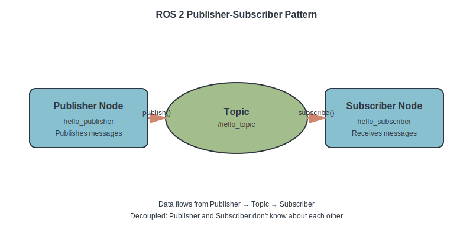

# Data Model: Physical AI & Humanoid Robotics Book

**Feature**: Physical AI & Humanoid Robotics Book
**Phase**: 1 - Design & Contracts
**Date**: 2025-12-06

## Overview

This document defines the content entities for the book. Since this is a static documentation site (Docusaurus), there is no database. Instead, "data" is represented as:
- **Markdown files** with YAML frontmatter (metadata)
- **Directory structure** (hierarchy and relationships)
- **Configuration files** (sidebars.js, docusaurus.config.js)

## Core Entities

### Entity 1: Module

**Description**: A major learning unit covering a specific technology domain (ROS 2, Gazebo/Unity, Isaac, VLA).

**Attributes**:
- `module_id` (string): Unique identifier (e.g., "module-1-ros2")
- `module_number` (integer): Sequential number (1, 2, 3, 4)
- `title` (string): Display name (e.g., "The Robotic Nervous System (ROS 2)")
- `description` (string): Brief summary (1-2 sentences)
- `learning_objectives` (list of strings): Measurable outcomes (3-5 items)
- `prerequisites` (list of strings): Required prior knowledge or modules
- `chapters` (list of Chapter IDs): Ordered list of child chapters
- `reading_time_minutes` (integer): Total time for all chapters (60-72 min)
- `hands_on_exercises_count` (integer): Number of tutorials (2-3)
- `sidebar_position` (integer): Order in navigation (1-4)

**Physical Representation**:
- Directory: `docs/module-N-<name>/`
- Index file: `docs/module-N-<name>/index.md`

**Example**:
```yaml
# docs/module-1-ros2/index.md frontmatter
---
id: module-1-ros2
title: "Module 1: The Robotic Nervous System (ROS 2)"
sidebar_position: 1
---

## Learning Objectives
- Understand ROS 2 as middleware for robot control
- Create and run ROS 2 nodes in Python
- Implement communication via topics and services
- Define robot geometry using URDF

## Prerequisites
- Basic Python programming
- Command line comfort
- Linux or Docker environment

[Content describing module overview]
```

**Relationships**:
- Contains many **Chapters** (1:N relationship)
- Prerequisite for other **Modules** (1:N relationship via prerequisites field)

**Validation Rules**:
- `module_number` must be unique and sequential (1-4)
- `reading_time_minutes` must be 60-72 minutes (calculated from chapter times)
- Must contain at least 5 chapters
- `learning_objectives` must have 3-5 items

---

### Entity 2: Chapter

**Description**: A specific topic within a module (e.g., "Your First ROS 2 Node").

**Attributes**:
- `chapter_id` (string): Unique identifier (e.g., "ros2-first-node")
- `title` (string): Display name (e.g., "Your First ROS 2 Node")
- `sidebar_position` (integer): Order within module (1-6)
- `last_updated` (date): ISO 8601 format (YYYY-MM-DD)
- `reading_time_minutes` (integer): Estimated time to read (12 min target)
- `learning_objectives` (list of strings): What reader will learn (3-5 items)
- `prerequisites` (list of strings): Required prior knowledge or chapters
- `code_examples_count` (integer): Number of runnable code snippets
- `diagrams_count` (integer): Number of visual figures
- `hands_on_tutorial` (boolean): Whether chapter includes step-by-step tutorial

**Physical Representation**:
- File: `docs/module-N-<name>/NN-<chapter-name>.md`

**Example**:
```yaml
# docs/module-1-ros2/02-first-ros2-node.md frontmatter
---
id: ros2-first-node
title: Your First ROS 2 Node
sidebar_position: 2
last_updated: 2025-12-06
---

## Learning Objectives
- Create a ROS 2 Python node using rclpy
- Understand publisher pattern for sending messages
- Run and debug a simple ROS 2 node

## Prerequisites
- Module 1, Chapter 1: ROS 2 Fundamentals
- ROS 2 Humble installed (see Quick Start)

[Chapter content]
```

**Content Structure** (within markdown body):
1. **Learning Objectives** section (## heading)
2. **Prerequisites** section
3. **Introduction** (2-3 paragraphs)
4. **Core Concepts** (### subheadings, 2-4 concepts)
5. **Hands-On Tutorial** (if applicable, step-by-step with code blocks)
6. **Summary** (key takeaways)
7. **Next Steps** (preview next chapter)

**Relationships**:
- Belongs to one **Module** (N:1 relationship)
- Contains many **Code Examples** (embedded in markdown)
- Contains many **Diagrams** (embedded as images)
- May reference other **Chapters** (N:N relationship via links)
- May reference **Glossary Entries** (N:N relationship via links)

**Validation Rules**:
- `reading_time_minutes` must be ~12 minutes (range: 10-15 min acceptable)
- Word count: 1,500-2,000 words
- Must have at least 1 code example OR 1 diagram
- `sidebar_position` must be unique within module
- `last_updated` must be valid ISO 8601 date

---

### Entity 3: Code Example

**Description**: A runnable code snippet demonstrating a concept (embedded in chapter markdown).

**Attributes**:
- `language` (string): Programming language (e.g., "python", "bash", "yaml")
- `file_path` (string, optional): Example filename if saving to disk (e.g., "hello_publisher.py")
- `description` (string): What the code does (1 sentence)
- `module_chapter` (string): Location reference (e.g., "Module 1, Chapter 2")
- `tested_environment` (object): Version information
  - `ros2_version` (string): e.g., "Humble"
  - `ubuntu_version` (string): e.g., "22.04"
  - `python_version` (string): e.g., "3.10"
- `expected_output` (string, optional): What user should see when running code
- `is_runnable` (boolean): Whether code can be copy-pasted and executed (MUST be true)

**Physical Representation**:
- Markdown fenced code block with language annotation:
  ````markdown
  ```python
  # Code here
  ```
  ````

**Example**:
````markdown
```python
#!/usr/bin/env python3
"""
Simple ROS 2 publisher node that sends string messages.
Part of Module 1, Chapter 2: Your First ROS 2 Node
Tested with: ROS 2 Humble, Ubuntu 22.04, Python 3.10
"""

import rclpy
from rclpy.node import Node
from std_msgs.msg import String

class HelloPublisher(Node):
    def __init__(self):
        super().__init__('hello_publisher')
        self.publisher_ = self.create_publisher(String, 'hello_topic', 10)
        self.timer = self.create_timer(1.0, self.timer_callback)
        self.counter = 0

    def timer_callback(self):
        msg = String()
        msg.data = f'Hello ROS 2! Count: {self.counter}'
        self.publisher_.publish(msg)
        self.get_logger().info(f'Publishing: "{msg.data}"')
        self.counter += 1

def main(args=None):
    rclpy.init(args=args)
    node = HelloPublisher()
    try:
        rclpy.spin(node)
    except KeyboardInterrupt:
        pass
    finally:
        node.destroy_node()
        rclpy.shutdown()

if __name__ == '__main__':
    main()

# Expected output (first 3 iterations):
# [INFO] Publishing: "Hello ROS 2! Count: 0"
# [INFO] Publishing: "Hello ROS 2! Count: 1"
# [INFO] Publishing: "Hello ROS 2! Count: 2"
```
````

**Relationships**:
- Belongs to one **Chapter** (N:1 relationship, embedded in markdown)
- May reference **Glossary Entries** (terms used in code comments)

**Validation Rules**:
- Must include header comment with description, module/chapter, tested environment
- Python code must be formatted with Black (4-space indentation)
- Must include inline comments explaining non-obvious logic
- If `expected_output` provided, must show realistic output
- `is_runnable` must be `true` (all code examples must work copy-paste)

---

### Entity 4: Diagram

**Description**: A visual illustration (SVG image) showing architecture, data flow, or concepts.

**Attributes**:
- `diagram_id` (string): Unique identifier (e.g., "ros2-node-communication")
- `filename` (string): SVG file name (e.g., "ros2-node-diagram.svg")
- `alt_text` (string): Accessibility description (what diagram shows)
- `title` (string): Caption (e.g., "Figure 1.2: ROS 2 Publisher-Subscriber Pattern")
- `source_file` (string, optional): Editable source (e.g., "ros2-nodes.drawio")
- `referenced_in_chapters` (list of Chapter IDs): Where diagram is used

**Physical Representation**:
- SVG file: `static/img/<filename>.svg`
- Optional source: `static/img/<filename>.drawio`
- Embedded in markdown: ``

**Example**:
```markdown


**Figure 1.2**: ROS 2 Publisher-Subscriber Pattern. The Publisher node sends messages to a topic, which the Subscriber node receives.
```

**Relationships**:
- Referenced by one or more **Chapters** (N:N relationship via markdown image syntax)

**Validation Rules**:
- Must be SVG format (scalable, small file size)
- Must have descriptive `alt_text` (accessibility requirement)
- File size should be < 100 KB
- Must use Physical AI color palette (defined in research.md)
- If `source_file` exists, must be committed to repo for future edits

---

### Entity 5: Glossary Entry

**Description**: Definition of a technical term (ROS 2, URDF, VSLAM, etc.).

**Attributes**:
- `term` (string): Technical term (e.g., "URDF")
- `full_name` (string, optional): Expanded acronym (e.g., "Unified Robot Description Format")
- `definition` (string): Clear explanation (1-3 sentences)
- `module_introduced` (string): Where term first appears (e.g., "Module 1")
- `related_terms` (list of strings): Cross-references (e.g., ["ROS 2", "Gazebo"])

**Physical Representation**:
- Single file: `docs/glossary.md`
- Alphabetical list of terms

**Example**:
```markdown
## U

### URDF (Unified Robot Description Format)

An XML-based format for defining robot geometry and kinematics. URDF files specify links (rigid bodies) and joints (connections) to describe robot structure. Introduced in Module 1, Chapter 5.

**Related terms**: ROS 2, Gazebo, XACRO

---
```

**Relationships**:
- Referenced by many **Chapters** (N:N relationship via markdown links)
- May reference other **Glossary Entries** via `related_terms`

**Validation Rules**:
- Terms must be alphabetically ordered
- `definition` must be 1-3 sentences (concise but complete)
- If acronym, must include `full_name`
- Must include `module_introduced` to help readers find context

---

### Entity 6: Hardware Configuration

**Description**: Equipment recommendation for setting up a robotics lab (workstation, edge kit, robot).

**Attributes**:
- `config_id` (string): Unique identifier (e.g., "workstation-recommended")
- `category` (string): Type of hardware ("workstation", "edge-kit", "robot")
- `tier` (string): Budget level ("minimum", "recommended", "premium")
- `components` (list of objects): Individual parts
  - `component_name` (string): e.g., "GPU"
  - `specification` (string): e.g., "NVIDIA RTX 4070 Ti (12GB VRAM)"
  - `purpose` (string): Why this spec is needed
  - `estimated_cost_usd` (integer): Approximate price
- `total_cost_usd` (integer): Sum of all components
- `use_cases` (list of strings): What this config enables

**Physical Representation**:
- Markdown tables in hardware chapters:
  - `docs/hardware/workstation-requirements.md`
  - `docs/hardware/edge-compute-kit.md`
  - `docs/hardware/robot-lab-options.md`

**Example**:
```markdown
### Recommended Workstation Configuration

| Component | Specification | Purpose | Est. Cost |
|-----------|---------------|---------|-----------|
| GPU | NVIDIA RTX 4080 (16GB VRAM) | Isaac Sim rendering + VLA model inference | $1,200 |
| CPU | Intel Core i7-13700K | Physics simulation (Gazebo) | $400 |
| RAM | 64GB DDR5 | Isaac Sim scene loading + multitasking | $250 |
| Storage | 2TB NVMe SSD | Fast data loading for ML training | $150 |
| OS | Ubuntu 22.04 LTS | Native ROS 2 support | Free |

**Total Cost**: ~$2,000

**Use Cases**: All modules (ROS 2, Gazebo, Isaac Sim, VLA), can run multiple simulations simultaneously, suitable for 1-2 students per workstation.
```

**Relationships**:
- Documented in dedicated **Chapters** (hardware/ directory)
- Referenced by **Module** prerequisites (e.g., Module 3 requires RTX GPU)

**Validation Rules**:
- Must include all critical components (GPU, CPU, RAM for workstation)
- `estimated_cost_usd` must be realistic (checked against market prices quarterly)
- `purpose` must explain why spec is needed (educational justification)
- Tiers must be meaningfully different (not just incremental upgrades)

---

## Configuration Entities

### Entity 7: Docusaurus Configuration

**Description**: Site-wide settings for the Docusaurus application.

**Attributes** (from `docusaurus.config.js`):
- `title` (string): Site title (e.g., "Physical AI & Humanoid Robotics")
- `tagline` (string): Subtitle (e.g., "From ROS 2 to Vision-Language-Action")
- `url` (string): Production URL (e.g., "https://username.github.io")
- `baseUrl` (string): Path prefix (e.g., "/Physical-ai-human-robotics-book/")
- `organizationName` (string): GitHub username or org
- `projectName` (string): GitHub repository name
- `themeConfig` (object): Theme settings
  - `colorMode`: Light/dark mode settings
  - `navbar`: Top navigation configuration
  - `footer`: Footer links and copyright
- `presets` (array): Docusaurus plugins (classic preset)

**Physical Representation**:
- File: `docusaurus.config.js` (JavaScript module)

**Validation Rules**:
- `url` and `baseUrl` must be configured for GitHub Pages deployment
- `organizationName` and `projectName` must match GitHub repo
- Theme colors must use Physical AI palette (from research.md)

---

### Entity 8: Sidebar Configuration

**Description**: Navigation structure defining module/chapter hierarchy.

**Attributes** (from `sidebars.js`):
- `docsSidebar` (array): Ordered list of sidebar items
  - `type`: "doc", "category", "link"
  - `id`: Chapter ID (for type="doc")
  - `label`: Display text
  - `items`: Nested items (for type="category")

**Physical Representation**:
- File: `sidebars.js` (JavaScript module)

**Example**:
```javascript
module.exports = {
  docsSidebar: [
    { type: 'doc', id: 'intro', label: 'Introduction' },
    { type: 'doc', id: 'quick-start', label: 'Quick Start' },
    {
      type: 'category',
      label: 'Module 1: ROS 2',
      items: [
        'module-1-ros2/index',
        'module-1-ros2/01-ros2-fundamentals',
        'module-1-ros2/02-first-ros2-node',
        'module-1-ros2/03-topics-and-services',
        'module-1-ros2/04-python-rclpy',
        'module-1-ros2/05-urdf-humanoids',
      ],
    },
    // ... more modules
    { type: 'doc', id: 'glossary', label: 'Glossary' },
  ],
};
```

**Validation Rules**:
- Module order must match `sidebar_position` in module index.md files
- Chapter order must match `sidebar_position` in chapter frontmatter
- All chapter IDs must reference existing markdown files
- Categories (modules) must be collapsible for better navigation

---

## Entity Relationships Diagram

```
Module (1:N) --contains--> Chapter (N:1)
  |                          |
  |                          |--contains--> Code Example (N:1, embedded)
  |                          |--references--> Diagram (N:N, images)
  |                          |--references--> Glossary Entry (N:N, links)
  |
  |--prerequisite-for--> Module (N:N, sequential learning)

Hardware Configuration --documented-in--> Chapter (hardware/)
Glossary Entry --cross-references--> Glossary Entry (related terms)
Sidebar Configuration --organizes--> Module + Chapter (navigation)
Docusaurus Configuration --renders--> All Entities (site-wide settings)
```

## Data Validation Pipeline

### Pre-Commit Validation

**Markdown Linting**:
- Tool: `markdownlint-cli2`
- Rules: Enforce consistent heading hierarchy, no trailing whitespace, proper list formatting
- Command: `npm run lint:markdown`

**Frontmatter Validation**:
- Tool: Custom Node.js script (`scripts/validate-frontmatter.js`)
- Checks:
  - All required fields present (id, title, sidebar_position)
  - `last_updated` is valid ISO 8601 date
  - `sidebar_position` is unique within module
  - `reading_time_minutes` is within acceptable range (10-15 min)

**Link Validation**:
- Tool: `broken-link-checker`
- Checks: All internal links resolve to existing files
- Command: `npm run check:links`

### Pre-Deploy Validation

**Build Success**:
- Tool: Docusaurus CLI
- Command: `npm run build`
- Validates: All markdown parses, no broken references, site builds without errors

**Reading Time Calculation**:
- Tool: Custom script (`scripts/calculate-reading-time.js`)
- Checks: Total reading time is within 4-6 hour target
- Reports: Per-module and total reading time

## Summary

**Total Entities**: 8 (6 content entities + 2 configuration entities)

**Content Hierarchy**:
1. **Module** (4 total)
   - Contains **Chapters** (5-6 per module, 21 total)
     - Embeds **Code Examples** (~150-200 total)
     - References **Diagrams** (8 total, reused across chapters)
     - Links to **Glossary Entries** (50+ terms)

**Hardware Guidance**:
- 3 **Hardware Configurations** per category (workstation, edge-kit, robot)
- 3 tiers per configuration (minimum, recommended, premium)

**Site Configuration**:
- 1 **Docusaurus Configuration** file (site-wide settings)
- 1 **Sidebar Configuration** file (navigation structure)

**Validation**: Pre-commit (markdown lint, frontmatter, links) + Pre-deploy (build success, reading time)
